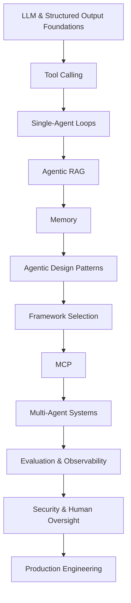

# Agentic AI Learning Roadmap

**From LLM fundamentals to production-ready AI agents in 12 weeks.**

This repository is a practical learning path for developers, technical professionals, and AI learners who want to understand Agentic AI by building progressively more capable systems.

The roadmap follows a simple principle:

**Learn → Build → Evaluate → Improve**

Instead of starting with complex multi-agent frameworks, the path begins with the foundations that agents depend on: structured model output, tool calling, state, retrieval, memory, and agent loops. It then progresses into MCP, multi-agent systems, evaluation, security, and production engineering.

> **Current release:** Weeks 1 and 2 include runnable projects. Later projects are intentionally marked as planned until working implementations are added.

## At a Glance

- **Difficulty:** Beginner → Intermediate → Production
- **Duration:** 12 weeks
- **Primary language:** Python
- **Approach:** Theory + hands-on projects
- **End goal:** Build, evaluate, secure, and deploy a production-oriented AI agent
- **Available projects:** [Week 1 - Structured LLM Assistant](./projects/01-structured-llm-assistant/) · [Week 2 - Tool Calling Agent](./projects/02-tool-calling-agent/)

## Learning Path



## Who This Roadmap Is For

This roadmap is designed for:

- Developers beginning with AI agents
- Python developers moving into Agentic AI
- AI and ML learners who want more hands-on practice
- Automation professionals building LLM-powered workflows
- Technical marketers experimenting with AI automation
- Students who already understand basic programming

### You do not need

- Advanced mathematics
- Deep ML research experience
- Previous multi-agent development experience
- Experience with every Agentic AI framework

## Prerequisites

Before starting, you should be comfortable with:

- Basic Python
- Functions, classes, lists, and dictionaries
- JSON
- REST APIs
- Environment variables
- Basic command-line usage
- Git and GitHub fundamentals

Helpful but optional:

- Prompt engineering
- SQL
- Basic LLM concepts
- Embeddings and vector databases

---

# Project Status

Only projects with tested, runnable implementations should be marked **Available**.

| Week | Topic | Project | Status |
|---|---|---|---|
| 1 | Structured LLM outputs | Structured LLM Assistant | ✅ Available |
| 2 | Tool calling | [Tool Calling Agent](./projects/02-tool-calling-agent/) | ✅ Available |
| 3 | Agent loops | Research Agent | 🔜 Planned |
| 4 | Retrieval | Agentic RAG | 🔜 Planned |
| 5 | Memory | Memory-Aware Assistant | 🔜 Planned |
| 6 | Agent patterns | Agent Pattern Examples | 🔜 Planned |
| 7 | Frameworks | Framework Comparison Demo | 🔜 Planned |
| 8 | MCP | SEO MCP Server | 🔜 Planned |
| 9 | Multi-agent systems | Multi-Agent Research Team | 🔜 Planned |
| 10 | Evaluation | Agent Evaluation Harness | 🔜 Planned |
| 11 | Security | Secure Approval-Based Agent | 🔜 Planned |
| 12 | Production | Production-Hardened Agent | 🔜 Planned |

---

# Week 1: LLM and Structured Output Foundations

Before building an agent, learn how to get reliable, machine-readable output from a model.

## Learn

- What an LLM does
- Tokens and context
- System and user instructions
- Structured Outputs
- Schema validation
- Why predictable output matters in agent systems
- Difference between a chatbot, workflow, and agent

## Build

### Structured LLM Assistant

The user provides a task such as:

> Create a plan for researching the Model Context Protocol.

The model returns validated structured data containing:

- objective
- category
- priority
- assumptions
- steps
- risks
- success criteria
- recommended next action

The implementation uses a Pydantic schema so downstream code can work with predictable typed data rather than fragile free-form text.

**Project:** [01-structured-llm-assistant](./projects/01-structured-llm-assistant/)

## Outcome

By the end of Week 1, you should understand why structured model output is one of the foundations of reliable agent systems.

---

# Week 2: Tool Calling and Function Calling

Agents become useful when they can interact with software outside the model.

## Learn

- Tool schemas
- Function calling
- Tool selection
- Tool arguments
- Tool execution
- Returning tool results to the model
- Validation
- Permission boundaries
- Failure handling

## Build

### Tool Calling Agent

This project gives the model access to three local, application-controlled tools:

- **Safe calculator** for arithmetic expressions
- **URL analyzer** for parsing URL structure without fetching the website
- **Text analyzer** for word, character, sentence, and unique-word counts

The model decides whether a tool is needed. The Python application validates and executes the requested function, returns the result to the model, and lets the model produce the final response.

```text
User request
    ↓
Model decides whether a tool is needed
    ↓
Structured function call
    ↓
Application validates arguments
    ↓
Local Python tool executes
    ↓
Function result returned to model
    ↓
Final answer
```

The project intentionally uses local deterministic tools so learners can focus on the function-calling lifecycle without adding extra third-party APIs.

**Project:** [02-tool-calling-agent](./projects/02-tool-calling-agent/)

## Outcome

Understand the separation between **model reasoning** and **application-controlled actions**, and learn how to validate, route, execute, and return tool results safely.

---

# Week 3: Build a Real Agent Loop

A tool-enabled response is not automatically a complete agent.

## Learn

- Agent loops
- Observe → decide → act cycles
- State
- Planning
- Stopping conditions
- Maximum-step limits
- Retries
- Failure states

## Planned Project: Research Agent

Input:

> Research the current Agentic AI framework landscape and summarize the major differences.

Proposed flow:

```text
Question
   ↓
Create research plan
   ↓
Search / collect sources
   ↓
Extract relevant information
   ↓
Check whether enough evidence exists
   ↓
Synthesize
   ↓
Final report
```

## Outcome

Build a bounded agent that can perform multiple steps without allowing an uncontrolled infinite loop.

---

# Week 4: Retrieval-Augmented Generation and Agentic RAG

## Learn

- Embeddings
- Chunking
- Semantic retrieval
- Vector stores
- Grounding
- Query rewriting
- Retrieval quality
- RAG vs Agentic RAG

## Planned Project: Agentic RAG

The agent should decide whether retrieval is needed and whether the retrieved evidence is sufficient.

```text
Question
   ↓
Need retrieval?
  ↙        ↘
No         Yes
↓           ↓
Answer    Retrieve
            ↓
      Evidence sufficient?
        ↙          ↘
      Yes           No
       ↓             ↓
     Answer      Search again
```

## Outcome

Understand retrieval as an agent decision rather than an unconditional pipeline step.

---

# Week 5: Agent Memory

## Learn

- Working / short-term memory
- Long-term memory
- Semantic memory
- Episodic memory
- Memory retrieval
- Summarization
- Expiration
- Deletion
- Privacy boundaries

## Planned Project: Memory-Aware Assistant

The assistant will retain selected non-sensitive preferences and retrieve them in later sessions.

Important principle:

> Memory should be intentional. Do not persist everything merely because it can be stored.

## Outcome

Understand when persistent state improves an agent and when it introduces privacy, security, and quality problems.

---

# Week 6: Agentic Design Patterns

## Learn

- Reflection
- Planning
- Routing
- Parallelization
- Evaluator-optimizer
- Human-in-the-loop
- Deterministic workflows vs agentic decisions

## Planned Project: Agent Pattern Examples

Small independent examples:

```text
06-agent-patterns/
├── reflection/
├── planning/
├── routing/
├── evaluator-optimizer/
├── parallelization/
└── human-in-the-loop/
```

## Outcome

Learn to select the smallest pattern that solves the problem instead of defaulting to a complex autonomous architecture.

---

# Week 7: Agent Frameworks and SDKs

Frameworks are implementation choices, not the starting point.

## Learn

Evaluate frameworks using criteria such as:

- State management
- Tool calling
- Structured outputs
- Human approval
- Tracing
- Testing
- MCP support
- Multi-agent support
- Model-provider flexibility
- Deployment model
- Maintenance and ecosystem

Frameworks worth studying include:

- OpenAI Agents SDK
- LangGraph
- Google Agent Development Kit
- Microsoft Agent Framework
- CrewAI
- LlamaIndex
- Pydantic AI
- smolagents

## Planned Project: Framework Comparison Demo

Implement the same small task using a limited number of frameworks and compare developer experience rather than declaring a universal winner.

## Further Resources

For a broader collection of frameworks, tutorials, courses, MCP resources, research papers, benchmarks, evaluation tools, and production guidance, see:

**[Awesome Agentic AI](https://github.com/Titan-Codes-Official/awesome-agentic-ai)**

## Outcome

Understand how to choose a framework based on system requirements.

---

# Week 8: Model Context Protocol (MCP)

## Learn

- MCP architecture
- Hosts
- Clients
- Servers
- Tools
- Resources
- Prompts
- Transport
- Permissions
- Trust boundaries

## Planned Project: SEO MCP Server

The project will expose practical website-analysis capabilities such as:

```text
get_page_title
get_meta_description
extract_headings
get_canonical
extract_internal_links
check_robots_meta
```

Example:

```text
User asks for page audit
        ↓
Agent / MCP client
        ↓
SEO MCP server
        ↓
Validated website-analysis tools
        ↓
Structured audit result
```

## Outcome

Understand how MCP standardizes the way AI applications access external capabilities and context.

---

# Week 9: Multi-Agent Systems

## Learn

- Specialized agents
- Supervisors
- Delegation
- Handoffs
- Routing
- Shared state
- Communication
- Failure propagation
- When not to use multiple agents

## Planned Project: Multi-Agent Research Team

Possible roles:

```text
Planner
   ↓
Researcher
   ↓
Fact Checker
   ↓
Writer
   ↓
Reviewer
```

The project will also compare this approach with a simpler single-agent implementation.

## Outcome

Understand that multi-agent systems are useful only when role separation creates enough value to justify additional complexity.

---

# Week 10: Agent Evaluation and Observability

A demo is not reliable merely because it produced one good result.

## Learn

### Evaluation

- Task completion
- Correct tool selection
- Groundedness
- Factual accuracy
- Citation quality
- Failure rate
- Latency
- Cost

### Observability

- Traces
- Spans
- Tool calls
- Retries
- Token usage
- Errors
- Model responses

## Planned Project: Agent Evaluation Harness

Example evaluation case:

```json
{
  "query": "Find the official MCP specification.",
  "expected_tool": "web_search",
  "must_include": ["Model Context Protocol"],
  "must_cite_source": true
}
```

## Outcome

Learn to measure agent behavior rather than relying on subjective impressions.

---

# Week 11: Guardrails, Security, and Human Oversight

## Learn

- Prompt injection
- Indirect prompt injection
- Malicious tool output
- Excessive tool permissions
- Secrets exposure
- Data leakage
- Authentication
- Authorization
- Sandboxing
- Rate limiting
- Audit logging
- Human approval gates

## Planned Project: Secure Approval-Based Agent

Example policy:

### Low-risk actions

May run automatically:

- Search
- Read approved data
- Perform calculations

### Sensitive actions

Require human approval:

- Send email
- Publish content
- Delete files
- Modify external systems
- Execute financial actions

## Outcome

Learn to treat tools as security boundaries and use least privilege.

---

# Week 12: Production-Ready Agents

## Learn

- Retries
- Exponential backoff
- Timeouts
- Circuit breakers
- Model fallbacks
- Caching
- Rate limits
- Structured logging
- Trace IDs
- Cost controls
- Configuration
- Testing
- Deployment
- Graceful degradation

## Planned Project: Production-Hardened Agent

An earlier project will be upgraded with production-oriented safeguards instead of building another unrelated demo.

Use the [Production Readiness Checklist](./checklists/production-readiness.md) while completing this stage.

## Outcome

Understand the difference between a prototype that works and an agent system that can be operated responsibly.

---

# Capstone: SEO Research and Website Analysis Agent

The capstone combines the roadmap into a practical system.

Proposed architecture:

```text
User / URL
    ↓
Coordinator
    ↓
Website Analyzer
    ↓
SEO Audit Tools
    ↓
Research
    ↓
Evidence Review
    ↓
Recommendations
```

Potential capabilities:

- Title and meta-description analysis
- Heading extraction
- Canonical inspection
- Internal-link analysis
- Content-structure review
- Research support
- Structured recommendations
- Human approval before sensitive actions
- Evaluation suite
- Tracing
- MCP integration

The capstone will be added only when a working implementation is ready.

---

# Repository Structure

Current release:

```text
agentic-ai-learning-roadmap/
├── README.md
├── LICENSE
├── CONTRIBUTING.md
├── SECURITY.md
├── .gitignore
├── checklists/
│   └── production-readiness.md
└── projects/
    ├── 01-structured-llm-assistant/
    │   ├── README.md
    │   ├── main.py
    │   ├── requirements.txt
    │   ├── .env.example
    │   └── sample_output.json
    └── 02-tool-calling-agent/
        ├── README.md
        ├── main.py
        ├── tools.py
        ├── test_tools.py
        ├── requirements.txt
        ├── .env.example
        └── sample_session.md
```

Future project directories will be added only when they contain usable implementations.

---

# Learning Principles

## 1. Start deterministic

If a fixed workflow solves the problem, use a fixed workflow.

## 2. Add agency only where it creates value

Use model-driven decisions for ambiguous tasks, not for every application step.

## 3. Validate boundaries

Validate model outputs and tool arguments before using them.

## 4. Limit autonomy

Use maximum steps, timeouts, permission scopes, and approval gates.

## 5. Evaluate continuously

Create test cases before declaring an agent reliable.

## 6. Treat external content as untrusted

Retrieved pages, documents, tool results, and user input can contain malicious instructions.

## 7. Keep humans in control

Sensitive actions should remain reviewable and reversible whenever possible.

---

# Recommended Progression

For each week:

1. Read the concepts.
2. Reproduce the example.
3. Change at least one part yourself.
4. Add tests.
5. Document a failure you observed.
6. Explain how you would make the system safer.
7. Continue only when you can explain the architecture without the code in front of you.

---

# Contributing

Contributions are welcome when they improve the educational value, correctness, safety, or usability of the roadmap.

Please read [CONTRIBUTING.md](./CONTRIBUTING.md) before opening a pull request.

This repository intentionally avoids adding empty project directories simply to make the roadmap appear complete.

---

# Security

Never commit API keys, access tokens, credentials, or private data.

See [SECURITY.md](./SECURITY.md) for the repository's security guidance.

---

# Related Resource

Looking for a broader Agentic AI resource library rather than a step-by-step curriculum?

Explore **[Awesome Agentic AI](https://github.com/Titan-Codes-Official/awesome-agentic-ai)**, a curated collection of AI agent frameworks, courses, tutorials, projects, MCP resources, evaluation tools, research papers, security resources, and production guidance.

---

# About

I'm Alok, working across SEO, outreach, automation, AI tools, and practical digital workflows. This repository documents a hands-on path for learning Agentic AI by building progressively more capable systems.

- **Personal Blog:** [alokblog.com](https://alokblog.com/)
- **LinkedIn:** [linkedin.com/in/alokrokz007](https://www.linkedin.com/in/alokrokz007/)
- **Titan Codes:** [titancodes.com](https://titancodes.com/)
- **Agentic AI Resource Library:** [Awesome Agentic AI](https://github.com/Titan-Codes-Official/awesome-agentic-ai)

---

# License

Code and documentation in this repository are released under the [MIT License](./LICENSE).
