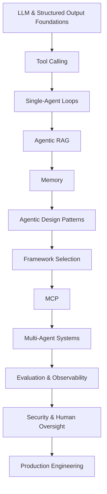

# Agentic AI Learning Roadmap

**From LLM fundamentals to production-ready AI agents in 12 weeks.**

This repository is a practical learning path for developers, technical professionals, and AI learners who want to understand Agentic AI by building progressively more capable systems.

The roadmap follows a simple principle:

**Learn → Build → Evaluate → Improve**

Instead of starting with complex multi-agent frameworks, the path begins with the foundations that agents depend on: structured model output, tool calling, state, retrieval, memory, and agent loops. It then progresses into MCP, multi-agent systems, evaluation, security, and production engineering.

> **Current release:** All 12 weeks now include runnable projects. The roadmap progresses from structured outputs and tool calling through retrieval, memory, multi-agent systems, evaluation, security, and production hardening.

## At a Glance

- **Difficulty:** Beginner → Intermediate → Production
- **Duration:** 12 weeks
- **Primary language:** Python
- **Approach:** Theory + hands-on projects
- **End goal:** Build, evaluate, secure, and deploy a production-oriented AI agent
- **Available projects:** [Week 1 - Structured LLM Assistant](./projects/01-structured-llm-assistant/) · [Week 2 - Tool Calling Agent](./projects/02-tool-calling-agent/) · [Week 3 - Research Agent](./projects/03-research-agent/) · [Week 4 - Agentic RAG](./projects/04-agentic-rag/) · [Week 5 - Memory-Aware Assistant](./projects/05-memory-aware-assistant/) · [Week 6 - Agent Pattern Examples](./projects/06-agent-pattern-examples/) · [Week 7 - Framework Comparison Demo](./projects/07-framework-comparison-demo/) · [Week 8 - SEO MCP Server](./projects/08-seo-mcp-server/) · [Week 9 - Multi-Agent Research Team](./projects/09-multi-agent-research-team/) · [Week 10 - Agent Evaluation Harness](./projects/10-agent-evaluation-harness/) · [Week 11 - Secure Approval-Based Agent](./projects/11-secure-approval-based-agent/) · [Week 12 - Production-Hardened Agent](./projects/12-production-hardened-agent/)

## Learning Path



## Who This Roadmap Is For

This roadmap is designed for:

- Developers beginning with AI agents
- Python developers moving into Agentic AI
- AI and ML learners who want more hands-on practice
- Automation professionals building LLM-powered workflows
- Technical marketers experimenting with AI automation
- Students who already understand basic programming

### You do not need

- Advanced mathematics
- Deep ML research experience
- Previous multi-agent development experience
- Experience with every Agentic AI framework

## Prerequisites

Before starting, you should be comfortable with:

- Basic Python
- Functions, classes, lists, and dictionaries
- JSON
- REST APIs
- Environment variables
- Basic command-line usage
- Git and GitHub fundamentals

Helpful but optional:

- Prompt engineering
- SQL
- Basic LLM concepts
- Embeddings and vector databases

---

# Project Status

Only projects with tested, runnable implementations should be marked **Available**.

| Week | Topic | Project | Status |
|---|---|---|---|
| 1 | Structured LLM outputs | [Structured LLM Assistant](./projects/01-structured-llm-assistant/) | ✅ Available |
| 2 | Tool calling | [Tool Calling Agent](./projects/02-tool-calling-agent/) | ✅ Available |
| 3 | Agent loops | [Research Agent](./projects/03-research-agent/) | ✅ Available |
| 4 | Retrieval | [Agentic RAG](./projects/04-agentic-rag/) | ✅ Available |
| 5 | Memory | [Memory-Aware Assistant](./projects/05-memory-aware-assistant/) | ✅ Available |
| 6 | Agent patterns | [Agent Pattern Examples](./projects/06-agent-pattern-examples/) | ✅ Available |
| 7 | Frameworks | [Framework Comparison Demo](./projects/07-framework-comparison-demo/) | ✅ Available |
| 8 | MCP | [SEO MCP Server](./projects/08-seo-mcp-server/) | ✅ Available |
| 9 | Multi-agent systems | [Multi-Agent Research Team](./projects/09-multi-agent-research-team/) | ✅ Available |
| 10 | Evaluation | [Agent Evaluation Harness](./projects/10-agent-evaluation-harness/) | ✅ Available |
| 11 | Security | [Secure Approval-Based Agent](./projects/11-secure-approval-based-agent/) | ✅ Available |
| 12 | Production | [Production-Hardened Agent](./projects/12-production-hardened-agent/) | ✅ Available |

---

# Week 1: LLM and Structured Output Foundations

Before building an agent, learn how to get reliable, machine-readable output from a model.

## Learn

- What an LLM does
- Tokens and context
- System and user instructions
- Structured Outputs
- Schema validation
- Why predictable output matters in agent systems
- Difference between a chatbot, workflow, and agent

## Build

### Structured LLM Assistant

The user provides a task such as:

> Create a plan for researching the Model Context Protocol.

The model returns validated structured data containing:

- objective
- category
- priority
- assumptions
- steps
- risks
- success criteria
- recommended next action

The implementation uses a Pydantic schema so downstream code can work with predictable typed data rather than fragile free-form text.

**Project:** [01-structured-llm-assistant](./projects/01-structured-llm-assistant/)

## Outcome

By the end of Week 1, you should understand why structured model output is one of the foundations of reliable agent systems.

---

# Week 2: Tool Calling and Function Calling

Agents become useful when they can interact with software outside the model.

## Learn

- Tool schemas
- Function calling
- Tool selection
- Tool arguments
- Tool execution
- Returning tool results to the model
- Validation
- Permission boundaries
- Failure handling

## Build

### Tool Calling Agent

This project gives the model access to three local, application-controlled tools:

- **Safe calculator** for arithmetic expressions
- **URL analyzer** for parsing URL structure without fetching the website
- **Text analyzer** for word, character, sentence, and unique-word counts

The model decides whether a tool is needed. The Python application validates and executes the requested function, returns the result to the model, and lets the model produce the final response.

```text
User request
    ↓
Model decides whether a tool is needed
    ↓
Structured function call
    ↓
Application validates arguments
    ↓
Local Python tool executes
    ↓
Function result returned to model
    ↓
Final answer
```

The project intentionally uses local deterministic tools so learners can focus on the function-calling lifecycle without adding extra third-party APIs.

**Project:** [02-tool-calling-agent](./projects/02-tool-calling-agent/)

## Outcome

Understand the separation between **model reasoning** and **application-controlled actions**, and learn how to validate, route, execute, and return tool results safely.

---

# Week 3: Build a Real Agent Loop

A tool-enabled response is not automatically a complete agent. Week 3 introduces explicit state, iterative actions, evidence checks, stopping conditions, and bounded autonomy.

## Learn

- Agent loops
- Observe → decide → act cycles
- Explicit state
- Research planning
- Search actions
- Evidence collection
- Evidence sufficiency checks
- Query refinement
- Stopping conditions
- Maximum-step limits
- Failure and incomplete-evidence states
- Source citation

## Build

### Research Agent

This project runs a complete research loop without requiring a paid API key.

It researches a question against a small local source corpus, records state across steps, evaluates whether the evidence is sufficient, refines the research query when needed, and produces a cited report.

Example input:

> Compare approaches used by major Agentic AI frameworks and SDKs.

```text
Question
   ↓
Build research plan
   ↓
Search local source corpus
   ↓
Collect unique evidence
   ↓
Evaluate evidence coverage
   ↓
Enough evidence?
  ↙            ↘
Yes             No
 ↓               ↓
Stop          Refine query
 ↓               ↓
Synthesize  ← Search again
   ↓
Cited report
```

The loop is bounded by a configurable maximum number of steps. It cannot continue indefinitely.

**Project:** [03-research-agent](./projects/03-research-agent/)

> **Zero-cost mode:** The working project uses only Python's standard library and a bundled educational source corpus. No OpenAI API key or paid service is required.

## Outcome

Build and inspect a bounded research agent that plans, acts, updates state, evaluates evidence, stops deliberately, and produces traceable source-backed output.

---

# Week 4: Retrieval-Augmented Generation and Agentic RAG

Week 4 moves from general research loops into retrieval-centered agent behavior.

## Learn

- Chunking
- Sparse and dense retrieval concepts
- Embeddings
- Vector stores
- Cosine similarity
- Grounding
- Query rewriting
- Retrieval quality
- Evidence sufficiency
- Citation and abstention
- RAG vs Agentic RAG

## Build

### Agentic RAG

This project runs a complete retrieval loop without requiring an API key.

It uses a bundled knowledge base and a local TF-IDF vector store to demonstrate the mechanics of retrieval. The agent decides whether retrieval is needed, rewrites queries, retrieves relevant chunks, evaluates evidence quality, retries when necessary, and answers only from collected context.

```text
Question
   ↓
Need retrieval?
  ↙        ↘
No         Yes
↓           ↓
Direct     Rewrite query
response        ↓
             Retrieve
                ↓
         Evidence sufficient?
           ↙          ↘
         Yes           No
          ↓             ↓
      Grounded      Rewrite /
       answer       search again
          ↓             ↓
       Citations ← bounded loop
```

The implementation deliberately uses **TF-IDF sparse vectors rather than paid embedding APIs**. This keeps the project free and makes the retrieval math inspectable. A production implementation can replace the local vectorizer with neural embeddings without changing the agent-level control flow.

**Project:** [04-agentic-rag](./projects/04-agentic-rag/)

> **Zero-cost mode:** Python standard library only. No OpenAI API key, vector-database account, or paid service is required.

## Outcome

Understand RAG as a controlled agent decision: determine whether retrieval is necessary, inspect whether retrieved evidence is strong enough, retry when it is not, and abstain instead of inventing unsupported claims.

---

# Week 5: Agent Memory

Memory can improve continuity, but persistent state also creates privacy, security, staleness, and deletion problems.

## Learn

- Working / short-term memory
- Persistent / long-term memory
- Semantic-style preference memory
- Episodic-style event memory
- Explicit memory writes
- Retrieval
- Updates and deduplication
- Expiration / TTL
- Deletion and clearing
- Storage limits
- Privacy boundaries
- Sensitive-data rejection
- Data minimization

## Build

### Memory-Aware Assistant

This project demonstrates a local memory system that stores only **explicitly requested, non-sensitive memories**.

The assistant separates temporary session state from persistent memory:

```text
User request
    ↓
Should this be remembered?
    ↓
Only explicit "remember" action
    ↓
Validate category + content
    ↓
Sensitive?
  ↙          ↘
Yes           No
 ↓             ↓
Reject      Save / update
                ↓
          Optional expiration
                ↓
         Retrieve in later run
                ↓
      User can forget / clear
```

Working memory exists only for the current process. Persistent memory is stored in a local JSON file outside the repository so learners do not accidentally commit runtime memory to Git.

The implementation includes:

- allowlisted memory categories
- sensitive-data screening
- value-length and store-size limits
- explicit upsert behavior
- TTL-based expiration
- lexical retrieval
- delete and clear operations
- atomic JSON writes
- corrupted-store detection
- no automatic memory capture

**Project:** [05-memory-aware-assistant](./projects/05-memory-aware-assistant/)

> **Zero-cost mode:** Python standard library only. No API key, database account, or paid service is required.

> **Important:** The demo store is plain JSON, not encrypted. It intentionally rejects obvious sensitive values, but the detector is not a substitute for a real data-classification or secrets-management system.

## Outcome

Understand that useful agent memory is not simply "save everything." A reliable memory system needs explicit write rules, retrieval boundaries, expiration, deletion, minimization, and user control.

---

# Week 6: Agentic Design Patterns

Week 6 shifts from individual capabilities to **control-flow patterns**.

The goal is not to make every task autonomous. It is to recognize the smallest coordination pattern that solves the problem reliably.

## Learn

- Reflection
- Planning
- Routing
- Parallelization
- Evaluator-optimizer
- Human-in-the-loop
- Bounded iteration
- Deterministic workflows vs agentic decisions
- Failure isolation
- Approval boundaries
- Pattern selection and composition

## Build

### Agent Pattern Examples

This project is a small pattern lab containing six independent, runnable examples:

```text
06-agent-pattern-examples/
└── patterns/
    ├── reflection.py
    ├── planning.py
    ├── routing.py
    ├── evaluator_optimizer.py
    ├── parallelization.py
    └── human_in_loop.py
```

Each example exposes its state and stopping conditions instead of hiding behavior behind a framework.

The patterns demonstrate:

- **Reflection:** critique and revise a draft within a bounded loop
- **Planning:** decompose a goal into ordered steps with dependencies
- **Routing:** choose the smallest specialist for a request and fall back safely
- **Parallelization:** execute independent work concurrently while isolating failures
- **Evaluator-optimizer:** improve a candidate until a measurable quality threshold or iteration limit is reached
- **Human-in-the-loop:** automatically allow low-risk actions while requiring explicit approval for sensitive actions

A shared CLI lets learners run one pattern or inspect all six.

**Project:** [06-agent-pattern-examples](./projects/06-agent-pattern-examples/)

> **Zero-cost mode:** Python standard library only. No API key, framework, hosted service, or paid dependency is required.

## Outcome

Learn to choose and combine agent patterns based on the task's control-flow requirements rather than defaulting to a large autonomous agent.

---

# Week 7: Agent Frameworks and SDKs

Frameworks are implementation choices, not the starting point.

Week 7 compares several current agent ecosystems against the same normalized task and the same set of engineering requirements.

## Learn

Evaluate frameworks using criteria such as:

- State management
- Tool calling
- Structured outputs
- Human approval
- Tracing
- Testing
- MCP support
- Multi-agent support
- Model-provider flexibility
- Durable / resumable execution
- Deployment model
- Maintenance and ecosystem

Frameworks worth studying include:

- OpenAI Agents SDK
- LangGraph
- Google Agent Development Kit
- Microsoft Agent Framework
- CrewAI
- LlamaIndex
- Pydantic AI
- smolagents

## Build

### Framework Comparison Demo

The working project compares three representative approaches:

- **OpenAI Agents SDK** for a lightweight agent runtime centered around agents, tools, handoffs, guardrails, sessions, and tracing
- **LangGraph** for low-level graph orchestration, explicit state, durable execution, and human-in-the-loop control
- **Pydantic AI** for typed agent development, structured outputs, broad provider support, tools, MCP, and local test models

All three are compared against the same support-triage task and the same normalized capability vocabulary.

The project includes:

- a deterministic common task
- validated framework profiles
- a capability matrix
- requirement-based filtering
- preference-based ranking
- architecture mappings for the same task
- official documentation links
- reference implementation sketches
- explicit notes about what cannot be compared fairly without a real model/provider

**Project:** [07-framework-comparison-demo](./projects/07-framework-comparison-demo/)

> **Zero-cost core:** The comparison harness uses only Python's standard library. It does not install framework packages, call an LLM, or require an API key.

> **Important:** Framework APIs evolve. The bundled profiles were checked against official documentation on **August 29, 2026**. Re-check official docs before copying reference snippets into production code.

## Further Resources

For a broader collection of frameworks, tutorials, courses, MCP resources, research papers, benchmarks, evaluation tools, and production guidance, see:

**[Awesome Agentic AI](https://github.com/Titan-Codes-Official/awesome-agentic-ai)**

## Outcome

Understand how to choose a framework based on system requirements, control-flow needs, testing strategy, provider constraints, and operational tradeoffs instead of declaring a universal winner.

---

# Week 8: Model Context Protocol (MCP)

MCP standardizes how AI applications discover and use external context and capabilities.

The current stable Python SDK v2 uses `MCPServer` as its high-level server API. This project follows the SDK's current tools/resources/prompts model and uses stdio as the default local transport.

## Learn

- MCP architecture
- Hosts
- Clients
- Servers
- Capability discovery
- Tools
- Resources
- Prompts
- stdio and Streamable HTTP
- Trust boundaries
- Model-controlled actions
- Application-controlled context
- User-controlled prompt templates
- Input validation
- Prompt-injection boundaries
- Why unrestricted network fetch tools increase risk

## Build

### SEO MCP Server

The server exposes deterministic website-analysis tools:

```text
get_page_title
get_meta_description
extract_headings
get_canonical
extract_internal_links
check_robots_meta
audit_page
```

It also exposes:

- an `seo://guidelines/on-page` resource
- an `seo://security/boundaries` resource
- an `seo_audit` prompt template

Architecture:

```text
User asks for page audit
        ↓
MCP host / client
        ↓
SEO MCP Server
        ↓
HTML supplied as untrusted data
        ↓
Deterministic SEO analysis tools
        ↓
Structured audit result
```

The project deliberately does **not** fetch arbitrary URLs. A host supplies the HTML snapshot to the server. This keeps the learning project local, deterministic, free, and avoids creating an unrestricted network-fetch capability.

**Project:** [08-seo-mcp-server](./projects/08-seo-mcp-server/)

> **SDK note:** The MCP adapter targets the current Python SDK v2 API verified on August 29, 2026. Install with `pip install "mcp[cli]>=2,<3"` before running the actual MCP server.

> **Cost:** The project itself requires no model API key and makes no paid model calls. The MCP Python SDK is an open-source dependency.

## Outcome

Understand how MCP standardizes access to tools, resources, and prompts while preserving explicit trust boundaries between untrusted content, model-controlled actions, and the application hosting the server.

---

# Week 9: Multi-Agent Systems

Multi-agent systems add coordination as a first-class engineering problem.

The goal is not to split one prompt into several classes and call the result a team. Week 9 makes delegation, shared state, evidence handoffs, review boundaries, and coordination overhead visible.

## Learn

- Specialized agents
- Supervisors / coordinators
- Delegation
- Handoffs
- Routing
- Shared state
- Agent-to-agent messages
- Parallel work
- Evidence provenance
- Failure isolation
- Failure propagation
- Review gates
- Coordination overhead
- When not to use multiple agents

## Build

### Multi-Agent Research Team

The working project uses five specialized roles:

```text
Question
   ↓
Planner
   ↓
Research tasks
   ↓
Researcher workers
   ↓
Evidence
   ↓
Fact Checker
   ↓
Verified claims
   ↓
Writer
   ↓
Draft report
   ↓
Reviewer
   ↓
Approved report
```

A coordinator owns the shared state and records explicit messages between roles.

Research tasks can run in parallel because each worker reads from the same local educational corpus without modifying external systems.

The project also includes a **single-agent baseline** using the same corpus and search function.

That comparison exposes the tradeoff:

```text
Multi-agent
+ role separation
+ task-level coverage
+ explicit review boundaries
- more coordination
- more messages
- more failure surfaces

Single-agent
+ simpler execution
+ lower coordination overhead
- less explicit specialization
- fewer independent review boundaries
```

The CLI can run:

- the multi-agent team
- the single-agent baseline
- a side-by-side comparison
- the bundled source list

**Project:** [09-multi-agent-research-team](./projects/09-multi-agent-research-team/)

> **Zero-cost mode:** Python standard library only. The project uses a bundled local research corpus and makes no model or network calls.

> **Important:** The agents are deliberately deterministic. This lets learners inspect coordination mechanics before adding an LLM to each role.

## Outcome

Understand when specialized roles and explicit review boundaries justify multi-agent complexity, and when a simpler single-agent workflow is the better engineering choice.

---

# Week 10: Agent Evaluation and Observability

A demo is not reliable merely because it produced one good result.

Week 10 turns expected agent behavior into executable evaluation cases and observable traces.

## Learn

### Evaluation

- Task completion
- Correct tool selection
- Groundedness
- Required-content checks
- Citation quality
- Abstention behavior
- Failure rate
- Regression thresholds
- Latency signals
- Cost signals

### Observability

- Trace IDs
- Spans
- Events
- Tool calls
- Step counts
- Errors
- Estimated token usage
- Cost metadata
- Candidate outputs

## Build

### Agent Evaluation Harness

The working harness evaluates an agent against a versioned local test suite.

Each case can define:

```json
{
  "query": "Find the official MCP specification.",
  "expected_status": "completed",
  "expected_tool": "local_search",
  "must_include": ["Model Context Protocol"],
  "must_cite_source": true,
  "allowed_source_ids": ["MCP-SPEC"],
  "max_steps": 4
}
```

The evaluator checks:

```text
Agent run
   ↓
Expected status?
   ↓
Correct tool?
   ↓
Required content present?
   ↓
Citation requirement satisfied?
   ↓
Citations grounded in observed tool results?
   ↓
Step budget respected?
   ↓
Trace structurally valid?
   ↓
Case result + aggregate metrics
```

The project includes two deterministic candidates:

- **good**: satisfies the bundled evaluation suite
- **broken**: intentionally introduces tool-selection and citation regressions

This proves that the harness can detect failures instead of only generating a success report.

Aggregate metrics include:

- case pass rate
- task-completion accuracy
- tool-selection accuracy
- content-check pass rate
- citation pass rate
- groundedness pass rate
- trace-integrity pass rate
- failure rate
- average observed latency
- estimated token usage
- reported cost

A regression checker compares the current metrics with a versioned baseline and fails when required floors are not met.

**Project:** [10-agent-evaluation-harness](./projects/10-agent-evaluation-harness/)

> **Zero-cost mode:** Python standard library only. No model API, network request, tracing vendor, or paid service is required.

> **Important:** Latency and token counts in this deterministic demo are operational signals, not universal quality scores. Production evaluation should add model-specific and domain-specific graders where appropriate.

## Outcome

Learn to define expected agent behavior as repeatable tests, inspect execution traces, aggregate meaningful metrics, and detect regressions before deployment.

---

# Week 11: Guardrails, Security, and Human Oversight

Security is not a single moderation check. Agent systems need controls around inputs, tool permissions, authorization, approvals, execution, and auditability.

## Learn

- Prompt injection
- Indirect prompt injection
- Malicious tool output
- Excessive tool permissions
- Secrets exposure
- Data leakage
- Authentication
- Authorization
- Least privilege
- Sandboxing
- Rate limiting
- Audit logging
- Human approval gates
- Approval expiry
- Fail-closed execution
- Idempotency and replay protection

## Build

### Secure Approval-Based Agent

The project models tools as explicit security boundaries.

Actions are classified into four policy levels:

```text
LOW
   ↓
May execute automatically

SENSITIVE
   ↓
Requires human approval

FORBIDDEN
   ↓
Never executes

UNKNOWN
   ↓
Fails closed
```

Low-risk demo actions include:

- Search a bundled local knowledge base
- Read an allowlisted local resource
- Perform bounded calculations

Sensitive simulated actions include:

- Send email
- Publish content
- Delete a file
- Modify an external-system record
- Execute a financial transfer

Sensitive actions do **not** execute merely because the agent planned them.

The workflow is:

```text
User request
   ↓
Input guardrails
   ↓
Action planning
   ↓
Policy classification
   ↓
Authorization check
   ↓
LOW ───────────────→ execute
   ↓
SENSITIVE
   ↓
Create approval request
   ↓
Human approves exact action?
   ├── No / expired / modified → blocked
   └── Yes
        ↓
   Approval token validation
        ↓
   Simulated executor
        ↓
   Append-only audit event
```

Approval tokens are bound to:

- exact action type
- canonical parameters
- requesting principal
- approval request ID
- expiry
- one-time use

Changing parameters after approval invalidates the approval.

The project also demonstrates:

- prompt-injection signal detection
- secret-pattern rejection
- allowlisted read targets
- role-based authorization
- per-principal rate limiting
- tainted tool-output handling
- approval expiry
- replay protection
- idempotency keys
- append-only audit records
- deterministic simulated external side effects

**Project:** [11-secure-approval-based-agent](./projects/11-secure-approval-based-agent/)

> **Zero-cost mode:** Python standard library only. No model API, network access, email provider, payment provider, or external system is required.

> **Safety boundary:** Sensitive operations are simulated inside an in-memory sandbox. This project does not send real email, publish real content, delete real files, change real external systems, or transfer real money.

## Outcome

Learn to treat tools as security boundaries, apply least privilege, require human approval for consequential actions, and fail closed when authorization or approval is uncertain.

---

# Week 12: Production-Ready Agents

Production hardening is about operating an agent predictably when dependencies are slow, unavailable, expensive, overloaded, or partially failing.

## Learn

- Retries
- Exponential backoff
- Jitter
- Per-attempt timeouts
- Request deadlines
- Circuit breakers
- Provider fallbacks
- Fresh and stale caching
- Rate limits
- Structured logging
- Trace IDs
- Metrics
- Cost and token budgets
- Configuration validation
- Health checks
- Idempotent operational patterns
- Testing
- Deployment boundaries
- Graceful degradation

## Build

### Production-Hardened Agent

This project upgrades a research-style local agent with an explicit reliability layer instead of introducing another unrelated prototype.

The runtime separates:

```text
Request
   ↓
Validation
   ↓
Rate limit
   ↓
Fresh cache?
   ├── Yes → return cached result
   └── No
        ↓
Request budget + deadline
        ↓
Primary provider
   ├── transient failure → bounded retry + exponential backoff
   ├── timeout → bounded retry
   ├── repeated failure → circuit opens
   └── success → cache + return
        ↓
Fallback provider
   ├── success → degraded success + cache
   └── failure
        ↓
Stale cache available?
   ├── Yes → stale-if-error response
   └── No → graceful unavailable response
```

The project includes:

- bounded retry policies
- exponential backoff with configurable jitter
- per-attempt timeout contracts
- overall request deadlines
- CLOSED / OPEN / HALF_OPEN circuit-breaker states
- primary-to-fallback provider routing
- TTL cache with stale-if-error support
- per-principal sliding-window rate limiting
- request-level attempt, token, and simulated-cost budgets
- JSON structured logs
- trace IDs propagated across attempts
- in-memory metrics counters
- health snapshots
- validated JSON configuration
- deterministic failure-injection scenarios
- graceful degradation when dependencies fail

**Project:** [12-production-hardened-agent](./projects/12-production-hardened-agent/)

> **Zero-cost mode:** All providers are deterministic local simulators. No model API, network access, API key, or paid service is required.

> **Timeout note:** The local provider adapter honors a timeout contract deterministically. Production network/model clients should additionally enforce transport-level cancellation and connection/read timeouts.

Use the [Production Readiness Checklist](./checklists/production-readiness.md) while reviewing the project.

## Outcome

Understand the difference between a prototype that works in the happy path and an agent system designed to remain observable, bounded, and useful during partial failure.

---

# Capstone: SEO Research and Website Analysis Agent

The capstone combines the roadmap into a practical system.

Proposed architecture:

```text
User / URL
    ↓
Coordinator
    ↓
Website Analyzer
    ↓
SEO Audit Tools
    ↓
Research
    ↓
Evidence Review
    ↓
Recommendations
```

Potential capabilities:

- Title and meta-description analysis
- Heading extraction
- Canonical inspection
- Internal-link analysis
- Content-structure review
- Research support
- Structured recommendations
- Human approval before sensitive actions
- Evaluation suite
- Tracing
- MCP integration

The capstone will be added only when a working implementation is ready.

---

# Repository Structure

Current release:

```text
agentic-ai-learning-roadmap/
├── README.md
├── LICENSE
├── CONTRIBUTING.md
├── SECURITY.md
├── .gitignore
├── checklists/
│   └── production-readiness.md
└── projects/
    ├── 01-structured-llm-assistant/
    │   ├── README.md
    │   ├── main.py
    │   ├── requirements.txt
    │   ├── .env.example
    │   └── sample_output.json
    ├── 02-tool-calling-agent/
    │   ├── README.md
    │   ├── main.py
    │   ├── tools.py
    │   ├── test_tools.py
    │   ├── requirements.txt
    │   ├── .env.example
    │   └── sample_session.md
    ├── 03-research-agent/
    │   ├── README.md
    │   ├── main.py
    │   ├── models.py
    │   ├── search.py
    │   ├── research_agent.py
    │   ├── test_research_agent.py
    │   ├── requirements.txt
    │   ├── sample_session.md
    │   └── data/
    │       └── sources.json
    ├── 04-agentic-rag/
    │   ├── README.md
    │   ├── main.py
    │   ├── models.py
    │   ├── chunking.py
    │   ├── vector_store.py
    │   ├── agentic_rag.py
    │   ├── test_agentic_rag.py
    │   ├── requirements.txt
    │   ├── sample_session.md
    │   └── data/
    │       └── knowledge_base.json
    ├── 05-memory-aware-assistant/
    │   ├── README.md
    │   ├── main.py
    │   ├── models.py
    │   ├── policy.py
    │   ├── store.py
    │   ├── assistant.py
    │   ├── test_memory_assistant.py
    │   ├── requirements.txt
    │   └── sample_session.md
    ├── 06-agent-pattern-examples/
    │   ├── README.md
    │   ├── main.py
    │   ├── models.py
    │   ├── test_agent_patterns.py
    │   ├── requirements.txt
    │   ├── sample_session.md
    │   └── patterns/
    │       ├── __init__.py
    │       ├── reflection.py
    │       ├── planning.py
    │       ├── routing.py
    │       ├── evaluator_optimizer.py
    │       ├── parallelization.py
    │       └── human_in_loop.py
    ├── 07-framework-comparison-demo/
    │   ├── README.md
    │   ├── main.py
    │   ├── models.py
    │   ├── profiles.py
    │   ├── comparison.py
    │   ├── common_task.py
    │   ├── test_framework_comparison.py
    │   ├── requirements.txt
    │   ├── sample_session.md
    │   ├── data/
    │   │   └── frameworks.json
    │   └── reference/
    │       ├── openai_agents_sdk.md
    │       ├── langgraph.md
    │       └── pydantic_ai.md
    ├── 08-seo-mcp-server/
    │   ├── README.md
    │   ├── server.py
    │   ├── seo_core.py
    │   ├── models.py
    │   ├── test_seo_core.py
    │   ├── test_mcp_surface.py
    │   ├── requirements.txt
    │   ├── sample_session.md
    │   ├── resources/
    │   │   └── on_page_guidelines.json
    │   ├── docs/
    │   │   └── security.md
    │   └── examples/
    │       └── sample_page.html
    ├── 09-multi-agent-research-team/
    │   ├── README.md
    │   ├── main.py
    │   ├── models.py
    │   ├── search.py
    │   ├── coordinator.py
    │   ├── single_agent.py
    │   ├── comparison.py
    │   ├── test_multi_agent_team.py
    │   ├── requirements.txt
    │   ├── sample_session.md
    │   ├── data/
    │   │   └── sources.json
    │   └── agents/
    │       ├── __init__.py
    │       ├── planner.py
    │       ├── researcher.py
    │       ├── fact_checker.py
    │       ├── writer.py
    │       └── reviewer.py
    ├── 10-agent-evaluation-harness/
    │   ├── README.md
    │   ├── main.py
    │   ├── models.py
    │   ├── cases.py
    │   ├── demo_agent.py
    │   ├── observability.py
    │   ├── evaluator.py
    │   ├── metrics.py
    │   ├── regression.py
    │   ├── reporters.py
    │   ├── test_evaluation_harness.py
    │   ├── requirements.txt
    │   ├── sample_session.md
    │   └── data/
    │       ├── eval_cases.json
    │       └── baseline.json
    ├── 11-secure-approval-based-agent/
    │   ├── README.md
    │   ├── main.py
    │   ├── models.py
    │   ├── guardrails.py
    │   ├── policy.py
    │   ├── planner.py
    │   ├── approvals.py
    │   ├── authorization.py
    │   ├── rate_limit.py
    │   ├── audit.py
    │   ├── executor.py
    │   ├── secure_agent.py
    │   ├── test_secure_agent.py
    │   ├── requirements.txt
    │   ├── sample_session.md
    │   └── data/
    │       ├── policy.json
    │       └── knowledge.json
    └── 12-production-hardened-agent/
        ├── README.md
        ├── main.py
        ├── models.py
        ├── errors.py
        ├── config.py
        ├── circuit_breaker.py
        ├── cache.py
        ├── rate_limit.py
        ├── budget.py
        ├── telemetry.py
        ├── service.py
        ├── resilience.py
        ├── agent.py
        ├── health.py
        ├── test_production_agent.py
        ├── requirements.txt
        ├── sample_session.md
        ├── config/
        │   └── default.json
        └── data/
            └── knowledge.json
```

Future project directories will be added only when they contain usable implementations.

---

# Learning Principles

## 1. Start deterministic

If a fixed workflow solves the problem, use a fixed workflow.

## 2. Add agency only where it creates value

Use model-driven decisions for ambiguous tasks, not for every application step.

## 3. Validate boundaries

Validate model outputs and tool arguments before using them.

## 4. Limit autonomy

Use maximum steps, timeouts, permission scopes, and approval gates.

## 5. Evaluate continuously

Create test cases before declaring an agent reliable.

## 6. Treat external content as untrusted

Retrieved pages, documents, tool results, and user input can contain malicious instructions.

## 7. Keep humans in control

Sensitive actions should remain reviewable and reversible whenever possible.

---

# Recommended Progression

For each week:

1. Read the concepts.
2. Reproduce the example.
3. Change at least one part yourself.
4. Add tests.
5. Document a failure you observed.
6. Explain how you would make the system safer.
7. Continue only when you can explain the architecture without the code in front of you.

---

# Contributing

Contributions are welcome when they improve the educational value, correctness, safety, or usability of the roadmap.

Please read [CONTRIBUTING.md](./CONTRIBUTING.md) before opening a pull request.

This repository intentionally avoids adding empty project directories simply to make the roadmap appear complete.

---

# Security

Never commit API keys, access tokens, credentials, or private data.

See [SECURITY.md](./SECURITY.md) for the repository's security guidance.

---

# Related Resource

Looking for a broader Agentic AI resource library rather than a step-by-step curriculum?

Explore **[Awesome Agentic AI](https://github.com/Titan-Codes-Official/awesome-agentic-ai)**, a curated collection of AI agent frameworks, courses, tutorials, projects, MCP resources, evaluation tools, research papers, security resources, and production guidance.

---

# About

I'm Alok, working across SEO, outreach, automation, AI tools, and practical digital workflows. This repository documents a hands-on path for learning Agentic AI by building progressively more capable systems.

- **Personal Blog:** [alokblog.com](https://alokblog.com/)
- **LinkedIn:** [linkedin.com/in/alokrokz007](https://www.linkedin.com/in/alokrokz007/)
- **Titan Codes:** [titancodes.com](https://titancodes.com/)
- **Agentic AI Resource Library:** [Awesome Agentic AI](https://github.com/Titan-Codes-Official/awesome-agentic-ai)

---

# License

Code and documentation in this repository are released under the [MIT License](./LICENSE).
